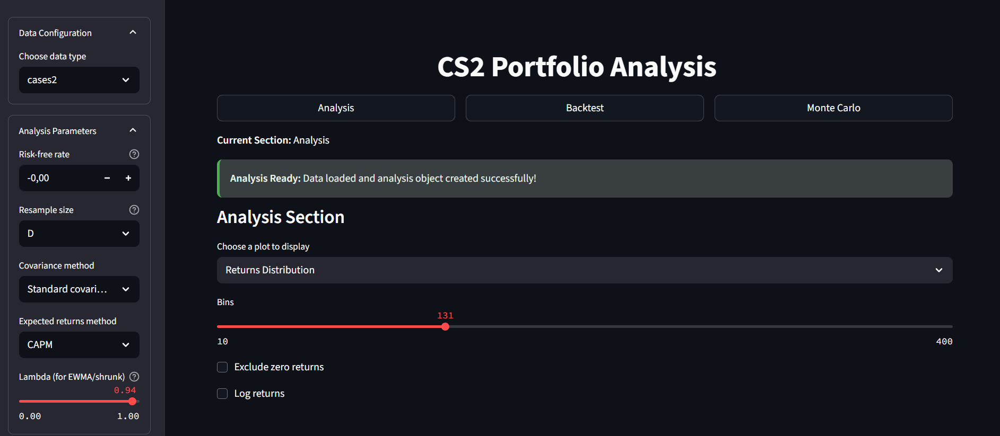
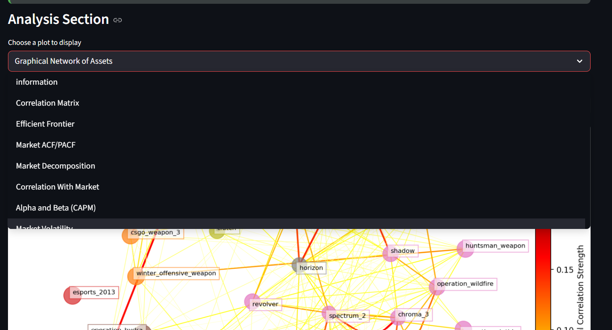
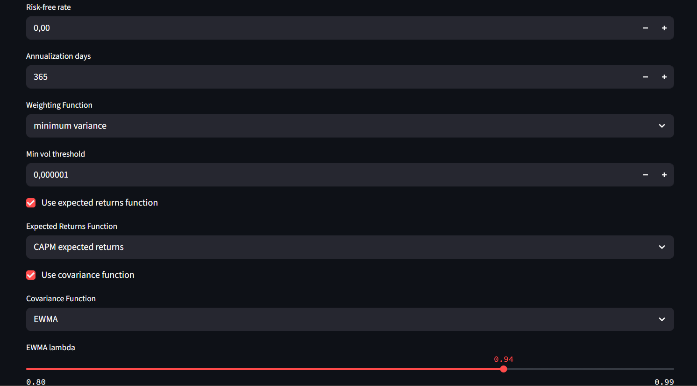

# CS2 Skins Portfolio Optimizer

A Python application for analyzing Counter-Strike 2 (CS2) skins as financial assets and performing portfolio optimization using various strategies including Minimum Variance Portfolio, Maximum Sharpe Ratio, and Black-Litterman models.

## Features

- **Data Extraction**: Automated scraping of CS2 skin prices from Steam Market
- **Data Processing**: Advanced price smoothing and spike detection algorithms
- **Portfolio Optimization**: Multiple covariance and expected returns estimation functions. Backtesting. Multiple optimization strategies
  - Minimum Variance Portfolio (MVP)
  - Maximum Sharpe Ratio Portfolio
  - Black-Litterman model
  - Monte Carlo simulations
- **Risk Analysis**: VaR, CVaR, and drawdown calculations
- **Visualization**: Comprehensive plotting and analysis tools

## examples and demonstration
in notebooks\code_demonstration.ipynb 

## Quick Start

### Prerequisites

- Python 3.8+
- Steam account with market access
- Steam session cookies (see Setup section)

### Installation

1. Clone the repository:
```bash
git clone https://github.com/yourusername/cs_portfolio.git
cd cs_portfolio
```

2. Create and activate virtual environment:
```bash
python -m venv venv
source venv/bin/activate  # On Windows: venv\Scripts\activate
```

3. Install dependencies:
```bash
pip install -r requirements.txt
```

4. Set up environment variables:
```bash
cp .env.example .env
# Edit .env with your Steam cookies
```

### Setup Steam Authentication (steam account needed)

1. Go to [Steam Market](https://steamcommunity.com/market/)
2. Open browser developer tools (F12)
3. Go to Network tab
4. Refresh the page
5. Find any request to `steamcommunity.com`
6. Copy the `sessionid` and `steamLoginSecure` cookies
7. Add them to your `.env` file:


## Web Application (Streamlit)

This project includes an interactive Streamlit dashboard for exploring CS2 assets, analyzing returns, and running portfolio optimizations visually. More in depth explanations are in the notebook.

### Launch the App

Make sure your virtual environment is activated and dependencies installed:

```bash
streamlit run app.py
```




